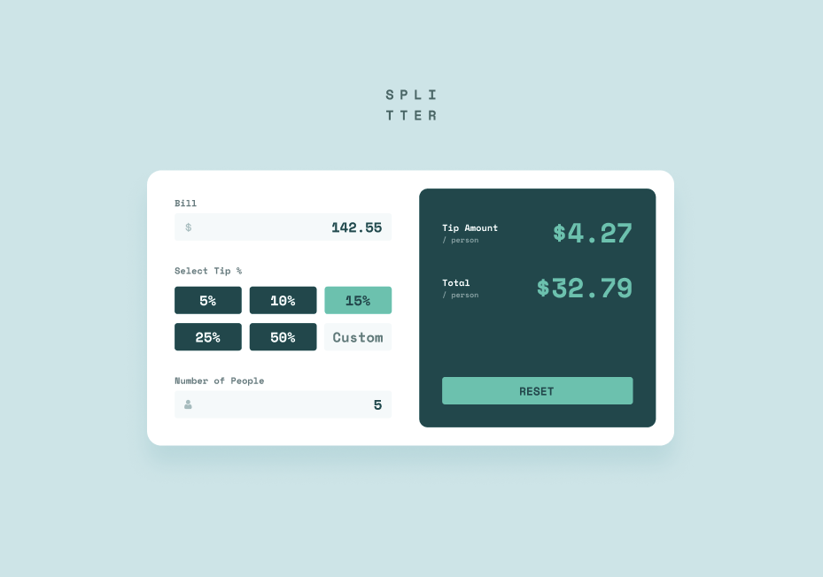
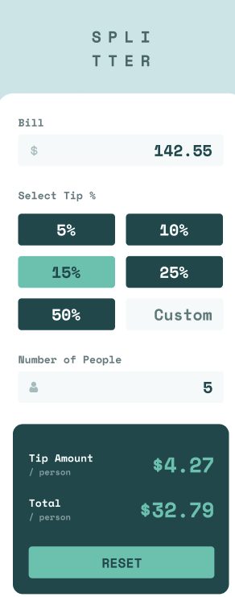

# Tip Calculator App

Welcome to my Tip Calculator App project! This project is part of the Frontend Mentor challenges, where I built a responsive tip calculator web application. Users can easily calculate the tip and total cost per person based on the bill amount and selected tip percentage.

## Table of Contents

- [Screenshots](#screenshots)
- [Features](#features)
- [Technologies Used](#technologies-used)
- [Getting Started](#getting-started)
- [Acknowledgements](#acknowledgements)


## Screenshots




## Features

- Responsive design for both desktop and mobile devices.
- Interactive UI with hover states for enhanced user experience.
- Calculate tip and total per person based on user input.

## Technologies Used

- HTML5
- CSS3
- TypeScript
- Vite
- React
- Redux Toolkit

## Getting Started

To get started with this project, follow these steps:

1. Clone the repository:

   ```bash
   git clone https://github.com/Xize-Wu/tip-calculator-app

   cd tip-calculator-app

2. Install dependencies:
    ```bash
    npm install

3. Run the project:
    ```bash
    npm run dev


## Acknowledgements

- Design: Frontend Mentor
- Assets: [Frontend Mentor](https://www.frontendmentor.io/challenges/tip-calculator-app-ugJNGbJUX) (Provide attribution if required)
